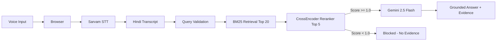

<div align="center">

# VaaniRAG AI

### Voice. Retrieval. Intelligence.

**A voice-first Retrieval-Augmented Generation system that lets users speak questions in Hindi and receive grounded, evidence-backed answers — built entirely as a solo project.**

[](https://react.dev)
[](https://python.org)
[](https://tailwindcss.com)
[](https://vite.dev)

[Run Locally](#local-setup) · [How It Works](#how-it-works) · [API Docs](#api-documentation) · [Architecture](#technical-architecture)

</div>

---

## The Problem

Most AI assistants generate answers from parametric memory — they hallucinate, cite no sources, and cannot verify their own claims. In Indian languages this problem is worse: few systems support Hindi voice input, and even fewer ground their responses in a verified knowledge base.

The result is a trust gap. Users speak a question, get a fluent-sounding answer, and have no way to know whether it is accurate, fabricated, or supported by any source at all.

**Voice-first retrieval must be both accessible and trustworthy.** A user should be able to ask in their own language, hear an answer, and see exactly which evidence backs it.

---

## The Solution

VaaniRAG AI is a complete voice-to-answer pipeline:

1. **You speak** — the browser captures audio via the microphone.
2. **Sarvam AI transcribes** — speech is converted to Hindi text using the `saaras:v3` model.
3. **BM25 retrieves evidence** — the transcript is matched against a pre-built knowledge base of Hindi query-passage pairs.
4. **A semantic guardrail decides** — a CrossEncoder reranker scores the top evidence chunks. If relevance is insufficient, generation is blocked entirely.
5. **Gemini answers from evidence** — when evidence passes the guardrail, Gemini 2.5 Flash generates a Hindi answer using only the retrieved passages.
6. **You see the result** — the answer, grounding status, guardrail reason, evidence count, and full latency breakdown.

The system **never generates without evidence** and **never invents information outside the provided passages**.

---

## Key Features

| Feature | Implementation |
|---|---|
| **Voice-first interaction** | Browser `MediaRecorder` captures audio; real-time waveform via `AudioContext` + `AnalyserNode` |
| **Speech-to-text** | Sarvam AI `saaras:v3` model, Hindi (`hi-IN`), `POST /api/stt` |
| **BM25 retrieval** | `rank-bm25` library with query expansion cache, top-20 candidates from a Parquet corpus |
| **Semantic reranking** | CrossEncoder `cross-encoder/mmarco-mMiniLMv2-L12-H384-v1` scores top-5 BM25 candidates |
| **Grounded generation** | Gemini 2.5 Flash with explicit "answer only from evidence" prompting; conditional on guardrail passage |
| **Three-layer guardrails** | HTTP query validation, semantic evidence scoring, prompt-level grounding instructions |
| **Exact match bypass** | Corpus-matching queries return instantly with zero LLM latency |
| **Bilingual support** | Hindi and English queries; automatic detection via Devanagari character scanning |
| **Pipeline dashboard** | React frontend with 8 interactive modules covering every stage of the pipeline |
| **Full latency transparency** | Every response includes `retrieval_ms`, `rerank_ms`, `gemini_ms`, and `total_ms` |

---

## How It Works



---

## Technical Architecture

### Frontend

- **React 19** + **TypeScript** + **Vite 8**
- **Tailwind CSS v4** with a custom dark theme (navy surfaces, cyan/violet/saffron accents)
- Hash-based routing (8 routes, no router library)
- Pure React hooks for state (no Redux, Zustand, or Context API)
- `VoiceEngineAdapter` pattern for pluggable STT backends
- Real-time audio waveform visualization via Web Audio API

### Backend

- **Python 3.12** HTTP server on port `10000`
- Adapter pattern: `VaaniRagService` protocol → `resolve_pipeline()` → `VaaniRagPipeline` bridge → `RealVaaniRagPipeline`
- Pipeline module swapping via environment variables (`VAANIRAG_PIPELINE_MODULE`, `VAANIRAG_PIPELINE_CLASS`)
- CORS-enabled for local frontend development

### Speech-to-Text

- **Sarvam AI** `saaras:v3` model
- Language: Hindi (`hi-IN`)
- Audio format: WAV (captured via `MediaRecorder`, sent as `multipart/form-data`)
- Endpoint: `POST /api/stt`

### Retrieval

- **Okapi BM25** via the `rank-bm25` library
- Corpus: `sentence_corpus.parquet` — Hindi query-passage pairs
- Query expansion: queries enriched with their corresponding answers from training data to boost recall
- Result caching: BM25 results are memoized to avoid redundant computation
- Default top-K: 20 candidates

### Corpus

- Format: Parquet (`sentence_corpus.parquet`) + Pickle (`bm25_index.pkl`)
- Columns: `query_id`, `passage_id`, `query_hi`, `answer_hi`, `passage_hi`, `is_selected`
- Language: Hindi
- Pre-built checkpoints stored in `backend/pipeline/retrieval_checkpoint/`

### Answer Generation

- **Gemini 2.5 Flash** via the `google-genai` SDK
- Generation is **conditional** — only called when the semantic guardrail passes
- Prompt instructs: answer only from provided evidence; do not add outside information
- If evidence is insufficient, the system returns `answer: null` with reason `INSUFFICIENT_EVIDENCE`

### API Endpoints

| Endpoint | Method | Purpose |
|---|---|---|
| `GET /api/health` | Health check with service status and version |
| `GET /api/metrics` | Runtime metrics: queries, latency, guardrail blocks, uptime |
| `POST /api/query` | Text query through the full RAG pipeline |
| `POST /api/stt` | Audio upload for speech-to-text transcription |
| `GET /api/knowledge-base` | Knowledge base document listing |

---

## RAG Pipeline

The retrieval pipeline executes in five stages:

**1. Query Validation** (`app/main.py`)
- Blocks empty queries (400 error)
- Blocks queries exceeding 500 characters (400 error)
- Increments guardrail block counter

**2. Query Expansion** (`pipeline/bm25_cache.py`)
- Looks up the original query in a pre-built expansion cache
- If found, uses the enriched query (original + answer terms) for BM25 scoring
- Boosts recall by incorporating training-data answer vocabulary

**3. BM25 Retrieval** (`pipeline/real_pipeline.py`)
- Tokenizes query via whitespace splitting
- Scores all corpus passages using Okapi BM25
- Returns top 20 candidates with relevance scores
- Each candidate: `rank`, `query_id`, `passage_id`, `score`, `text`, `is_selected`

**4. Semantic Guardrail** (`pipeline/semantic_guardrail.py`)
- Takes the top 5 BM25 candidates
- CrossEncoder scores each (query, evidence) pair
- Maximum score compared against threshold `1.0`
- Score >= 1.0: proceed to generation
- Score < 1.0: block generation, return `INSUFFICIENT_EVIDENCE`

**5. Grounded Generation** (`pipeline/gemini_harness.py`)
- Gemini 2.5 Flash with a Hindi-language prompt
- Prompt provides top 5 evidence chunks formatted as `[rank] text`
- Explicit instructions: answer only from evidence; if evidence is insufficient, say so
- Retry logic: up to 2 retries with exponential backoff (0.5s * attempt)
- Timeout: 15 seconds

---

## Grounding and Trust

VaaniRAG AI implements three layers of defense against unsupported answers:

| Layer | Component | What It Does |
|---|---|---|
| **HTTP Validation** | `validate_query()` in `app/main.py` | Rejects empty, oversized, or malformed queries before they reach the pipeline |
| **Semantic Evidence Guard** | `evidence_guard()` in `pipeline/semantic_guardrail.py` | CrossEncoder scores top-5 evidence chunks; blocks generation if best score < 1.0 |
| **Prompt Grounding** | Gemini prompt in `pipeline/real_pipeline.py` | Instructs the LLM to answer only from provided evidence and refuse when evidence is insufficient |

**Guardrail statuses returned by the pipeline:**

| Status | Meaning |
|---|---|
| `EXACT_CORPUS_MATCH` | Query matched a corpus entry exactly; answer returned from cache, zero LLM latency |
| `EVIDENCE_SUFFICIENT` | CrossEncoder score >= 1.0; Gemini generated a grounded answer |
| `INSUFFICIENT_EVIDENCE` | CrossEncoder score < 1.0 or no evidence returned; generation blocked |
| `NO_EVIDENCE` | BM25 returned zero candidates; generation blocked |
| `EMPTY_GENERATION` | Gemini returned empty text; treated as failure |
| `GEMINI_API_KEY_NOT_CONFIGURED` | Missing API key; generation skipped |

When the guardrail blocks, the response includes `answer: null` and `grounded: false`. The system never fabricates an answer.

---

## Voice Pipeline

The end-to-end voice flow:

```
Microphone -> getUserMedia() -> MediaRecorder -> WAV blob
    -> POST /api/stt -> Sarvam AI saaras:v3 -> Hindi transcript
    -> POST /api/query -> BM25 retrieval -> CrossEncoder guardrail
    -> Gemini 2.5 Flash (conditional) -> Grounded answer
    -> Response to frontend: answer + evidence + latency breakdown
```

**Frontend states:** `idle` → `listening` → `transcribing` → `retrieving` → `generating` → `completed`

**Audio visualization:** Real-time volume levels computed via `AnalyserNode.getByteFrequencyData()` with exponential smoothing (`0.65 * old + 0.35 * new`), driving a 36-bar circular waveform.

---

## API Documentation

### `GET /api/health`

Returns service health status.

```json
{
  "status": "operational",
  "service": "VaaniRAG AI Backend",
  "version": "0.1.0",
  "deployment": "local"
}
```

### `GET /api/metrics`

Returns runtime metrics.

```json
{
  "queriesProcessed": 0,
  "transcriptions": 0,
  "avgLatencyMs": null,
  "sourcesIndexed": 0,
  "guardrailBlocks": 0,
  "uptimeSeconds": 3600,
  "lastQuery": null
}
```

### `POST /api/query`

Runs a text query through the full RAG pipeline.

**Request:**

```json
{
  "query": "Your question here",
  "topK": 5
}
```

| Field | Type | Required | Notes |
|---|---|---|---|
| `query` | string | Yes | Max 500 characters |
| `topK` | integer | No | Default 5, clamped 1-20 |

**Response:**

```json
{
  "query": "Your question here",
  "answer": "The grounded answer from evidence.",
  "grounded": true,
  "guardrail_reason": "EVIDENCE_SUFFICIENT",
  "evidence_count": 5,
  "retrieval_ms": 12.34,
  "rerank_ms": null,
  "gemini_ms": 845.67,
  "total_ms": 858.01,
  "deployment": "local"
}
```

| Field | Type | Description |
|---|---|---|
| `answer` | string or null | Generated answer, or null if guardrail blocked |
| `grounded` | boolean | Whether the answer passed the semantic guardrail |
| `guardrail_reason` | string | One of: `EXACT_CORPUS_MATCH`, `EVIDENCE_SUFFICIENT`, `INSUFFICIENT_EVIDENCE`, etc. |
| `evidence_count` | integer | Number of evidence chunks used |
| `retrieval_ms` | number or null | BM25 retrieval time in milliseconds |
| `rerank_ms` | number or null | CrossEncoder reranking time (null in lightweight deployment) |
| `gemini_ms` | number or null | Gemini generation time in milliseconds |
| `total_ms` | number or null | End-to-end pipeline time in milliseconds |

### `POST /api/stt`

Transcribes audio to text via Sarvam AI.

**Request:** `multipart/form-data` with field `file` containing a WAV audio blob.

**Response:**

```json
{
  "transcript": "The transcribed Hindi text"
}
```

### `GET /api/knowledge-base`

Returns knowledge base document listing.

**Response:**

```json
{
  "documents": []
}
```

---

## Performance

The following metrics are from the pre-built BM25 retrieval checkpoint evaluation:

| Metric | Value |
|---|---|
| Recall@20 | 89.42% |
| Average retrieval latency | 75.40 ms |
| P50 retrieval latency | 65.23 ms |
| P70 retrieval latency | 82.55 ms |
| P100 retrieval latency | 345.67 ms |

> These are measurements from the retrieval checkpoint, not a live benchmark run. Actual end-to-end latency (including STT and Gemini generation) varies based on network conditions and API response times.

---

## Local Setup

### Prerequisites

- **Node.js** (for frontend)
- **Python 3.12** (for backend)
- **Sarvam AI API key** (for speech-to-text)
- **Gemini API key** (for answer generation)

### 1. Clone and install frontend dependencies

```bash
git clone <repository-url>
cd vaani-rag-ai
cd frontend
npm install
```

### 2. Install backend dependencies

```bash
cd ../backend
pip install -r requirements.txt
```

### 3. Configure environment variables

Create a `.env` file in the `backend/` directory:

```env
SARVAM_API_KEY=your_sarvam_api_key_here
GEMINI_API_KEY=your_gemini_api_key_here
```

### 4. Start the backend server

```bash
cd backend
python -m app.main
```

The backend starts on `http://localhost:10000`.

### 5. Start the frontend dev server

```bash
cd frontend
npm run dev
```

The frontend starts on `http://localhost:5173` and proxies API requests to the backend.

### 6. Open the application

Navigate to `http://localhost:5173` in your browser. Click the microphone button to start a voice query, or type a question in the Voice Playground.

---

## Environment Variables

| Variable | Where | Purpose |
|---|---|---|
| `SARVAM_API_KEY` | `backend/.env` | Authentication for Sarvam AI speech-to-text API |
| `GEMINI_API_KEY` | `backend/.env` | Authentication for Google Gemini answer generation |
| `VAANIRAG_PIPELINE_MODULE` | `backend/.env` (optional) | Override the pipeline module path |
| `VAANIRAG_PIPELINE_CLASS` | `backend/.env` (optional) | Override the pipeline class name |

> **Never commit `.env` files to version control.** The `.gitignore` is configured to exclude `.env` and `.env.*` files. Always use environment-based secret management.

---

## Project Structure

```
vaani-rag-ai/
├── frontend/                    # React SPA
│   ├── src/
│   │   ├── components/          # Reusable UI components
│   │   │   ├── VoiceWaveform.tsx
│   │   │   ├── RagPipelineVisualizer.tsx
│   │   │   ├── StageDetailPanel.tsx
│   │   │   └── ...
│   │   ├── pages/               # Route-level page components
│   │   │   ├── Overview.tsx
│   │   │   ├── RagPipeline.tsx
│   │   │   ├── RetrievalLab.tsx
│   │   │   ├── LatencyObservatory.tsx
│   │   │   ├── TrustSafety.tsx
│   │   │   ├── KnowledgeBase.tsx
│   │   │   └── Settings.tsx
│   │   ├── hooks/
│   │   │   ├── useVoiceSession.ts   # Voice recording + STT lifecycle
│   │   │   └── useBackendStatus.ts  # Backend health monitoring
│   │   ├── lib/
│   │   │   ├── api.ts               # API client (localhost:10000)
│   │   │   └── voice/
│   │   │       ├── types.ts         # Voice state types
│   │   │       └── engine.ts        # VoiceEngineAdapter singleton
│   │   ├── config/
│   │   │   ├── modules.ts           # Module metadata and features
│   │   │   └── navigation.ts        # Route definitions
│   │   └── App.tsx                  # Hash-based router
│   ├── package.json
│   └── vite.config.ts               # Dev proxy configuration
│
├── backend/                     # Python pipeline + HTTP server
│   ├── app/
│   │   ├── main.py              # FastAPI-style HTTP server + STT endpoint
│   │   └── services/            # Service adapters
│   ├── pipeline/
│   │   ├── real_pipeline.py     # Core RAG pipeline orchestrator
│   │   ├── bm25_cache.py        # BM25 retrieval + query expansion cache
│   │   ├── semantic_guardrail.py # CrossEncoder evidence scoring
│   │   ├── gemini_harness.py    # Gemini API wrapper with retries
│   │   ├── sarvam_stt.py        # Sarvam AI STT (standalone)
│   │   ├── vaanirag.py          # Pipeline adapter bridge
│   │   └── retrieval_checkpoint/
│   │       ├── bm25_index.pkl           # Pre-built BM25 index
│   │       ├── sentence_corpus.parquet  # Hindi query-passage corpus
│   │       └── ...                      # Other checkpoint artifacts
│   └── requirements.txt
│
├── api/                         # Vercel serverless deployment
│   ├── server.py                # Full HTTP server (STT + RAG)
│   ├── query.py                 # Standalone RAG query handler
│   ├── health.py                # Lightweight health check
│   └── pyproject.toml
│
└── vercel.json                  # Vercel build configuration
```

---

## Demo Flow

The end-to-end demonstration follows this sequence:

1. **Open the Voice Playground** — the frontend loads with the voice recording interface and a circular waveform visualization.

2. **Speak a question** — click the microphone button. The browser requests microphone access, begins recording, and the waveform animates in response to your voice.

3. **Stop recording** — click the button again. The audio is captured as a WAV blob.

4. **STT transcription** — the blob is sent to `POST /api/stt`. Sarvam AI's `saaras:v3` model transcribes the speech to Hindi text. The transcript appears in the UI.

5. **RAG retrieval** — the transcript is sent to `POST /api/query`. BM25 retrieves the top 20 candidates from the Hindi corpus. The CrossEncoder reranks the top 5.

6. **Guardrail decision** — if the best CrossEncoder score >= 1.0, Gemini 2.5 Flash generates a grounded answer. If not, the system returns `answer: null` with the reason `INSUFFICIENT_EVIDENCE`.

7. **Results displayed** — the UI shows the answer, grounding status, guardrail reason, evidence count, and full latency breakdown (retrieval time, reranking time, generation time, total time).

---

## Design and Engineering Principles

**Modular architecture.** The frontend and backend are fully decoupled. The pipeline uses an adapter pattern (`VaaniRagService` → `resolve_pipeline()` → `VaaniRagPipeline` → `RealVaaniRagPipeline`) so the retrieval engine can be swapped by changing two environment variables without touching any API code.

**Separation of concerns.** Frontend handles UI and voice capture. Backend handles STT, retrieval, guardrails, and generation. Each component has a single responsibility.

**Error handling at every boundary.** HTTP validation blocks bad input. The semantic guardrail blocks unsupported evidence. The Gemini harness handles retries, timeouts, and empty responses. The frontend maps DOMException names to user-friendly error states.

**API boundaries.** All communication between frontend and backend flows through well-defined REST endpoints with typed request/response contracts. The frontend API client is a single file (`lib/api.ts`) with full TypeScript interfaces.

**Grounded generation by default.** The system is designed so that generation never happens without passing through the evidence guardrail first. This is enforced at the pipeline level, not just in the prompt.

**Honest representation.** Unmeasured values are displayed as `null` or `"--"`, never fabricated. The frontend explicitly shows "not connected" states when the backend is offline.

**Maintainable codebase.** No external state management libraries. No router libraries. Hash-based routing in 20 lines. State managed with standard React hooks. The entire backend pipeline is under 1000 lines of Python.

---

## Security

- **Secrets are never exposed.** API keys (`SARVAM_API_KEY`, `GEMINI_API_KEY`) are stored in `backend/.env` and loaded server-side only. They are never sent to the frontend or included in API responses.
- **`.env` files are gitignored.** The `.gitignore` excludes `.env` and `.env.*` (except `.env.example`).
- **CORS is scoped.** The backend sends `Access-Control-Allow-Origin: *` only for local development. In production (Vercel deployment), serverless functions handle requests directly.
- **No credential logging.** The backend does not log API keys, audio content, or transcript text to stdout.
- **Input validation.** Queries are validated for length (max 500 chars) and emptiness before reaching the retrieval pipeline.

---

## Limitations

Honest assessment of current constraints:

- **Hindi-focused.** The STT model (`saaras:v3`) is configured for Hindi (`hi-IN`). English STT is not integrated. The corpus is primarily Hindi.
- **BM25 only.** The API path uses BM25 for retrieval. FAISS vector index files exist in the checkpoint directory but are not wired into the current query pipeline.
- **Single-user local server.** The Python HTTP server is not designed for concurrent production traffic. It runs on a single thread.
- **No persistent metrics.** The `/api/metrics` endpoint returns session-level counters that reset on server restart.
- **Guardrail threshold is fixed.** The CrossEncoder threshold (`1.0`) is hardcoded. There is no dynamic adjustment based on query difficulty.
- **No authentication.** The local server has no user authentication or rate limiting.
- **Corpus is static.** The knowledge base is a pre-built Parquet file. There is no dynamic document ingestion or re-indexing pipeline.

---

## Future Roadmap

Clearly marked as planned improvements, not existing functionality:

- **Dense retrieval integration** — Wire the existing FAISS index into the query pipeline for hybrid BM25 + vector search.
- **Multilingual STT** — Extend speech-to-text support to English, Tamil, Bengali, Telugu, and other Indian languages.
- **Dynamic corpus ingestion** — Build an API for uploading new documents and triggering re-indexing.
- **Streaming responses** — Stream Gemini tokens to the frontend for faster perceived latency.
- **Persistent metrics** — Store query logs and latency data in a database for historical analysis.
- **Adaptive guardrail thresholds** — Dynamically adjust the CrossEncoder score threshold based on query complexity.
- **Production deployment** — Containerize the backend with Docker and deploy behind a reverse proxy with authentication.
- **Reranking experiments** — Evaluate larger cross-encoders and LLM-based rerankers for improved evidence selection.

---

## Why VaaniRAG AI

Voice is the most natural interface for billions of people. But voice assistants that hallucinate are worse than no assistant at all — they erode trust.

VaaniRAG AI demonstrates that voice-first retrieval can be both accessible and trustworthy. By combining Hindi speech recognition, BM25 evidence retrieval, a semantic guardrail that blocks unsupported answers, and grounded generation that cites its sources, the system shows a practical path toward AI that speaks your language and proves its answers.

Every response carries evidence. Every latency metric is transparent. Every guardrail decision is visible. The system is designed not just to answer questions, but to earn trust.

---

## Solo Builder

Built independently from architecture and implementation through integration, debugging, testing, and final demo. Every line of frontend React, every pipeline stage, every API endpoint, and every guardrail was designed, coded, and tested as a single-person effort.
